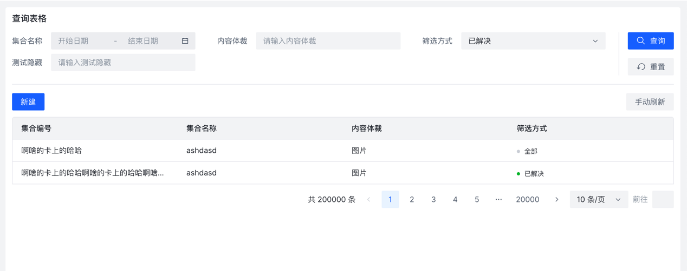

### 基础数据模型

```js
import { ref } from 'vue'

const fsEnum = {
  all: { text: '全部', status: 'normal' },
  open: {
    text: '未解决',
    status: 'danger'
  },
  closed: {
    text: '已解决',
    status: 'success'
  },
  processing: {
    text: '解决中',
    status: 'processing'
  }
}

const columns = [
  { no: '集合编号' },
  { name: { title: '集合名称', search: true, valueType: 'range-picker' } },
  { type: { title: '内容体裁', search: true } },
  {
    fs: {
      title: '筛选方式',
      search: true,
      valueType: 'select',
      initialValue: 'closed',
      slotName: 'fsSlot',
      valueEnum: fsEnum
    }
  },
  {
    extr: {
      hideInTable: true,
      title: '测试隐藏',
      search: true
    }
  }
]

const loadData = (pagination, params) => {
  console.log(params)
  console.log(pagination)
  return new Promise((resolve) => {
    setTimeout(() => {
      resolve([
        {
          id: 1,
          no: '啊啥的卡上的哈哈',
          name: 'ashdasd',
          type: '图片',
          fs: 'all'
        },
        {
          id: 2,
          no: '啊啥的卡上的哈哈啊啥的卡上的哈哈啊啥的卡上的哈哈啊啥的卡上的哈哈啊啥的卡上的哈哈啊啥的卡上的哈哈啊啥的卡上的哈哈啊啥的卡上的哈哈啊啥的卡上的哈哈啊啥的卡上的哈哈啊啥的卡上的哈哈啊啥的卡上的哈哈啊啥的卡上的哈哈啊啥的卡上的哈哈',
          name: 'ashdasd',
          type: '图片',
          fs: 'closed'
        }
      ])
    }, 500)
  })
}
```

### columns设置
```js
// 新的columns会经过setTableColumn处理，然后导出原格式

// 示例
const columns = [
  { no: '集合编号' },
  { name: { title: '集合名称', search: true, valueType: 'range-picker' } },
  { type: { title: '内容体裁', search: true } },
  {
    fs: {
      title: '筛选方式',
      search: true,
      valueType: 'select',
      initialValue: 'closed',
      slotName: 'fsSlot',
      valueEnum: fsEnum
    }
  },
  {
    extr: {
      hideInTable: true,
      title: '测试隐藏',
      search: true
    }
  },
  // [dataIndex]: { ...原column配置 }
]
```
### 补充文档 - AND - [https://arco.design/vue/component/table#API](https://arco.design/vue/component/table#API)
| 字段           | 类型                                                                            | 说明                              | 默认值   |
|--------------|-------------------------------------------------------------------------------|---------------------------------|-------|
| ...          |                                                                               | 除了原本colum配置新增如下                 |       |
| hideInTable  | boolean                                                                       | 是否隐藏于表格中（只用作标案查询）               | false |
| search       | boolean                                                                       | 是否处理为搜索项                        | false |
| initialValue |                                                                               | 搜索项的表单初始值）                      |       |
| filterLabel  | string                                                                        | 可替换搜索名称（于表格名称不一致时覆盖表格名称title）   |       |
| filterField  |                                                                               | 搜索项绑定字段（默认取dataIndex）           | false |
| valueType    | enum                                                                          | select \| input \| range-picker | input |
| valueEnum  | interface ValueEnum { [key: string]: { text: string 字段名必须为text, status: '' }; | ）               |  |


### ProTable基本用法

```vue
<pro-table 
  :request="loadData" 
  :columns="columns" 
/>
```

### ProTable手动刷新
```vue
const actionRef = ref()

/// 分页和表单项都重置
actionRef.reset()

/// 分页重置，表单项不重置
actionRef.reload()

<pro-table 
  ref="actionRef"
  :request="loadData" 
  :columns="columns" 
/>
```

### 效果图

